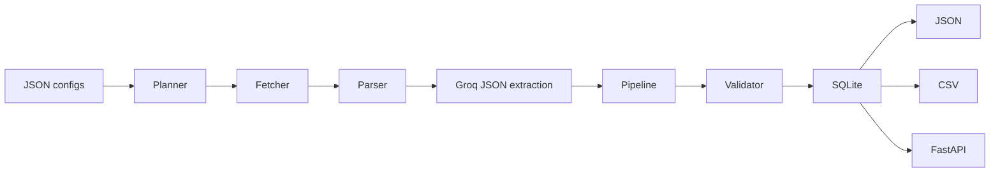

# University Intelligence Database Agent

Python agent for scraping structured university intelligence data for exactly two configured universities, saving to SQLite, and exporting nested JSON plus CSV files.

## Setup

```bash
python -m venv .venv
source .venv/bin/activate
pip install -r requirements.txt
playwright install
cp .env.example .env
```

Fill `.env` with `GROQ_API_KEY` (free key at <https://console.groq.com>). The default model is `llama-3.3-70b-versatile`; override `GROQ_MODEL` if needed (e.g. `llama-3.1-8b-instant` for faster/cheaper extraction).

Optional LLM fallback controls:

```bash
DISABLE_LLM_FALLBACK=true
MAX_LLM_PAGINATION_CHECKS_PER_RUN=50
```

Use `DISABLE_LLM_FALLBACK=true` for fully deterministic/offline test runs. Extraction still needs `GROQ_API_KEY`; the CLI will save mostly empty records instead of crashing when no key is configured.

## Configure Universities

Edit:

- `config/universities/uni_a.json`
- `config/universities/uni_b.json`

Replace all `TODO` placeholders with real university details and page paths. The agent is config-driven: adding a third university later should only require adding another JSON config file.

## Architecture



Core flow:

1. `core/config_loader.py` validates JSON configs.
2. `core/discovery.py` optionally classifies homepage/sitemap links into categories for `--mode auto`.
3. `core/planner.py` builds a deduplicated crawl frontier.
4. `core/fetcher.py` respects robots.txt, rate limits, tries `httpx`, then uses Playwright for thin pages.
5. `core/parser.py` cleans HTML and discovers pagination/detail links.
6. `core/extractor.py` asks Groq (`llama-3.3-70b-versatile`) for schema-valid JSON only.
7. `core/pipeline.py` aggregates fragments into `UniversityRecord`.
8. `core/validator.py` flags ranges, stale dates, currencies, and missing values.
9. `storage/db.py` saves and exports records.

## Hybrid Discovery and Pagination

The crawler uses a hybrid approach:

- Rule-based fast path: free, deterministic, and used first for universal patterns such as `rel="next"`, numbered pagination, URL page increments, icon-only next links, and common multilingual next-page labels.
- LLM fallback: used only when deterministic rules cannot identify the answer. It handles edge cases such as unusual markup, non-English UI, ambiguous homepage navigation, and JS-only pagination controls.

Category discovery calls the LLM once per university in `--mode auto`, using up to 100 deduplicated homepage/sitemap links. If the LLM fails or `DISABLE_LLM_FALLBACK=true`, the agent falls back to `_FALLBACK_CATEGORY_KEYWORDS`.

Pagination fallback only runs for listing pages after deterministic checks return nothing. It returns either a next URL or a CSS selector for a load-more control. `MAX_LLM_PAGINATION_CHECKS_PER_RUN` limits these extra calls.

## CLI

`--university` is optional for both `scrape` and `export`. When omitted, the agent loops over every config in `config/universities/` automatically.

```bash
# Scrape all universities (auto discovery mode — no flags required)
python3 main.py scrape

# Scrape a single university
python3 main.py scrape --university iitd

# Override discovery mode
python3 main.py scrape --university uoft --mode manual

# Export all universities as JSON + CSV (no flags required)
python3 main.py export

# Export one university in a specific format
python3 main.py export --university iitd --format json
python3 main.py export --university uoft --format csv
```

Defaults: `--mode auto`, `--format both`.

One failure in a multi-university run does **not** abort the rest; a success/failure summary is printed at the end.

Generated files go to `storage/output/`.

## API

```bash
uvicorn api.server:app --reload
```

Endpoints:

- `GET /universities`
- `GET /universities/{id}`
- `GET /universities/{id}/{category}`

## Tests

```bash
pytest
```

The fetcher tests are mocked and do not perform live network requests.

## Evaluation

After scraping and exporting JSON, manually fill:

- `eval/ground_truth/uni_a.json`
- `eval/ground_truth/uni_b.json`

Then run:

```bash
python eval/run_eval.py
```

This writes `eval/eval_report.md` with exact, fuzzy, missing, wrong, and hallucinated match labels.

## Known Limitations

- Configs are placeholders until you choose two real universities and source URLs.
- Cross-source validation is currently conservative and mostly handled by confidence/notes; richer fragment-level comparison can be expanded after real sources are selected.
- `storage/cache/` is scaffolded for future hash-based caching but not integrated into the fetch pipeline.
- LLM extraction quality depends heavily on source page clarity and may need prompt tuning after first real runs.
